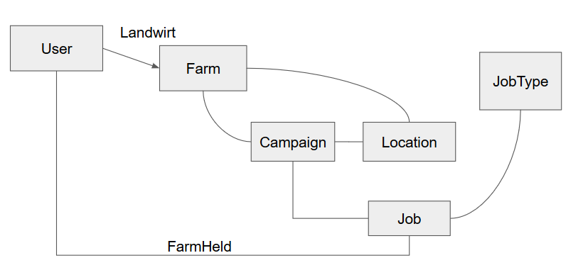

## Prerequisites
docker-compose

## Install & Run
```bash
docker-compose up
```

## Use Django Management Commands:
Use this while `docker-compose up` is running. Open a second terminal tab and execute:
```bash
./manage
```

## Useful Django Management Commands

# create superuser
```bash
./manage.sh # on host
python manage.py createsuperuser --email admin@example.com --username admin # in container
``` 


## Database Structure

